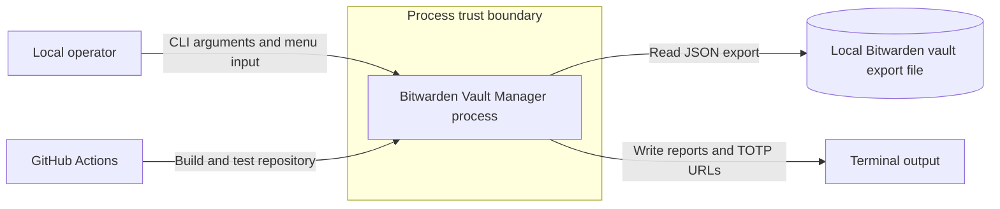
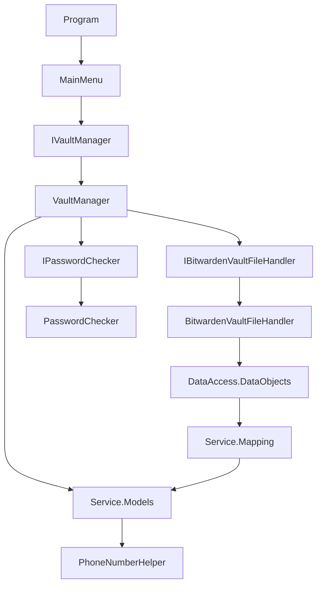
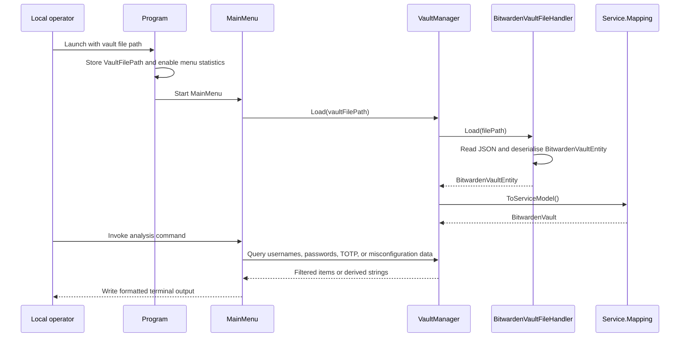
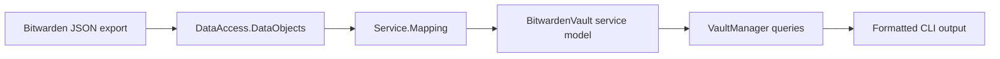
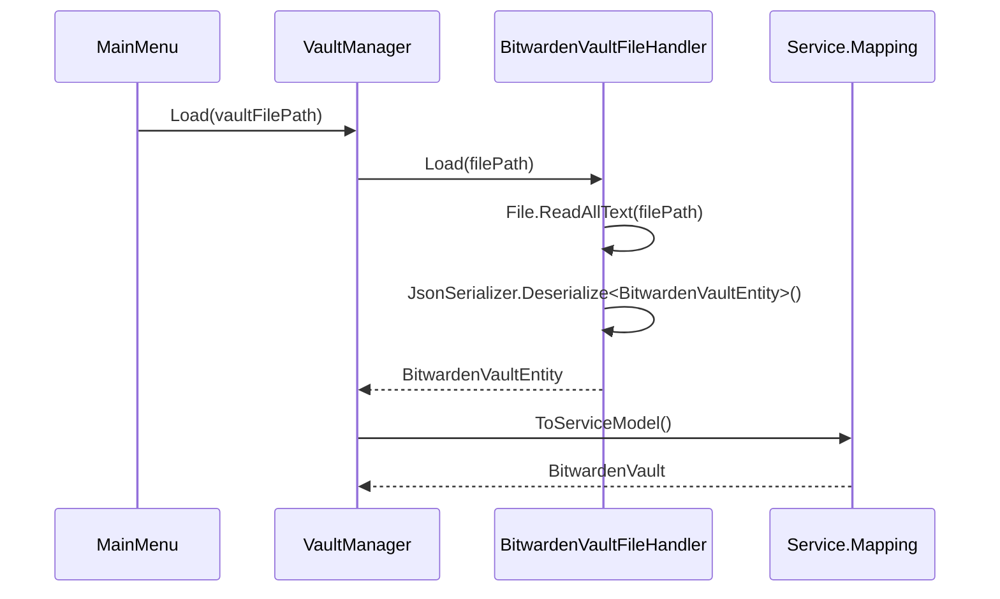
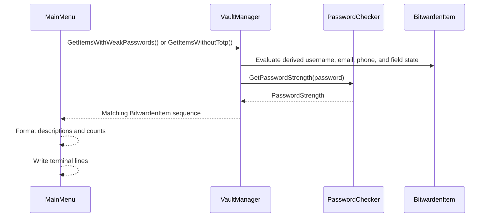
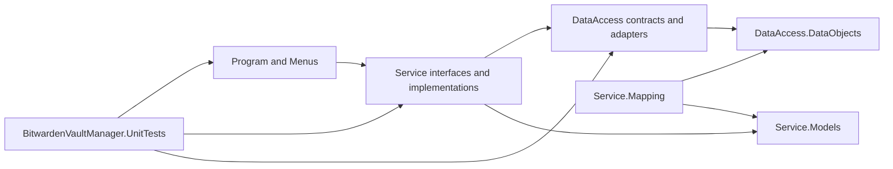

# Bitwarden Vault Manager Architecture

This document describes the current architecture of Bitwarden Vault Manager, a single-process console application for inspecting exported Bitwarden vault data, identifying weak spots, and emitting analysis results to the terminal.

## 📑 Table of Contents

- [Purpose](#-purpose)
- [System Context](#-system-context)
- [Architectural Style](#-architectural-style)
- [Runtime Flow](#-runtime-flow)
- [Components](#-components)
- [Architectural Areas](#-architectural-areas)
- [Data Architecture](#-data-architecture)
- [Interfaces and Integrations](#-interfaces-and-integrations)
- [Key Flows](#-key-flows)
- [Cross-Cutting Concerns](#-cross-cutting-concerns)
  - [Security and Privacy](#security-and-privacy)
  - [Error Handling](#error-handling)
  - [Configuration](#configuration)
- [Dependency Direction and Rules](#-dependency-direction-and-rules)
- [External Dependencies](#-external-dependencies)
- [Deployment and Operations](#-deployment-and-operations)
- [Compatibility Contracts](#-compatibility-contracts)
- [Testing and Verification](#-testing-and-verification)
- [Design Constraints](#-design-constraints)
- [Extension Points](#-extension-points)
- [Architecture Decisions](#-architecture-decisions)
- [Source Map](#-source-map)
- [Related Documentation](#-related-documentation)

## 🎯 Purpose

Bitwarden Vault Manager reads a Bitwarden vault export from the local filesystem, transforms the export into service models, and executes analysis commands that identify reused passwords, weak passwords, missing email addresses, absent TOTP configuration, and related findings. This document is intended for contributors who need to locate ownership boundaries, understand runtime flow, and evaluate the architectural impact of changes to parsing, analysis rules, or command presentation.

## 🌐 System Context

The system boundary is the Bitwarden Vault Manager process defined by [BitwardenVaultManager/Program.cs](BitwardenVaultManager/Program.cs). A local operator launches the executable with a vault export path, interacts with menu commands through the terminal, and receives analysis results on standard output. The application reads a Bitwarden JSON export from the local filesystem through [BitwardenVaultManager/DataAccess/BitwardenVaultFileHandler.cs](BitwardenVaultManager/DataAccess/BitwardenVaultFileHandler.cs), transforms that file into service models through the mapping layer, and performs in-memory analysis only. No remote service, database, or outbound network dependency is implemented in the runtime path.



The principal external boundaries are:
- **Local operator:** Supplies the vault file path, selects commands, and interprets console output.
- **Local Bitwarden vault export file:** Provides the JSON data source consumed by the application.
- **Terminal:** Carries prompts, status messages, and analysis results.
- **GitHub Actions:** Executes repository build and test verification through [.github/workflows/dotnet.yml](.github/workflows/dotnet.yml).

## 🏗️ Architectural Style

The repository implements a layered console-analysis architecture. The entry point and menu layer own process startup and interactive presentation, the service layer owns analysis and query logic, and the data-access layer owns deserialisation of the Bitwarden export. Mapping extensions separate data-object representation from service-model representation. This structure keeps user interaction concerns out of analysis code and confines file-format coupling to the adapter and mapping boundary.



The principal architecture boundaries are:
- **Entry and presentation boundary:** Owns process setup, menu registration, console prompts, and formatted output.
- **Analysis boundary:** Owns vault loading orchestration, filtering, grouping, password-strength evaluation, and TOTP URL derivation.
- **Data-format boundary:** Owns JSON deserialisation and the exported vault entity shape.
- **Model translation boundary:** Owns conversion between exported data objects and in-memory service models.

## 🔄 Runtime Flow



The principal runtime sequence is:
1. The operator launches the executable with the Bitwarden export path as the command-line argument.
2. [BitwardenVaultManager/Program.cs](BitwardenVaultManager/Program.cs) stores that path and starts [BitwardenVaultManager/Menus/MainMenu.cs](BitwardenVaultManager/Menus/MainMenu.cs).
3. `MainMenu` constructs or receives an `IVaultManager`, loads the vault through `Load(filePath)`, and registers CLI commands.
4. `VaultManager` reads the JSON export through `IBitwardenVaultFileHandler`, converts entities into service models, and retains the in-memory vault for subsequent queries.
5. Each menu command calls a specific `IVaultManager` query, formats the result set, and writes lines to the terminal.

## 🧩 Components

| Component | Responsibility | Principal Dependencies | Lifetime or Ownership |
|-----------|----------------|------------------------|-----------------------|
| `Program` | Process entry, UTF-8 console configuration, vault path capture, and menu startup | `NuciCLI.Menus.MenuManager`, `MainMenu` | One static process entry point per execution |
| `MainMenu` | Command registration, user prompts, result formatting, and delegation to analysis services | `IVaultManager`, `NuciCLI`, `PhoneNumberHelper` | One menu instance per process startup |
| `VaultManager` | Vault loading orchestration and in-memory analysis queries | `IBitwardenVaultFileHandler`, `IPasswordChecker`, service models, mappings | One in-memory analysis service per menu lifecycle |
| `BitwardenVaultFileHandler` | Filesystem read and JSON deserialisation of exported vault data | `System.IO`, `System.Text.Json`, `BitwardenVaultEntity` | Stateless adapter instantiated by `VaultManager` by default |
| `PasswordChecker` | Password-strength scoring heuristic | LINQ and `PasswordStrength` | Stateless service instantiated by `VaultManager` by default |
| `Service.Mapping` extensions | Conversion between exported entities and analysis models | Data objects and service models | Stateless extension methods invoked during load |
| `Service.Models` | In-memory domain view with derived username, email, and phone lookups | `PhoneNumberHelper` | Retained inside `VaultManager` after load |
| `BitwardenVaultManager.UnitTests` | Verification of runtime behaviour, adapters, mappings, CLI formatting, and coverage-sensitive contracts | `NUnit`, `Moq`, production assembly | Test-only project executed by `dotnet test` |

## 🗂️ Architectural Areas

### Entry and Presentation

Paths:
- [BitwardenVaultManager/Program.cs](BitwardenVaultManager/Program.cs)
- [BitwardenVaultManager/Menus](BitwardenVaultManager/Menus)

Responsibilities:
- Accept the vault file path from command-line arguments.
- Start the menu-driven CLI session.
- Convert analysis results into terminal-friendly output.
- Prompt the operator for follow-up query parameters such as email address, username, phone number, text, or password length.

Boundary rules:
- This area may depend on service interfaces and helper functions used for input normalisation.
- This area must not parse JSON vault files directly.
- This area owns output formatting, not analysis logic.

### Analysis and Domain Model

Paths:
- [BitwardenVaultManager/Service](BitwardenVaultManager/Service)
- [BitwardenVaultManager/Service/Models](BitwardenVaultManager/Service/Models)
- [BitwardenVaultManager/Service/Helpers](BitwardenVaultManager/Service/Helpers)
- [BitwardenVaultManager/Service/Mapping](BitwardenVaultManager/Service/Mapping)

Responsibilities:
- Load and retain the in-memory vault model.
- Derive usernames, email addresses, phone numbers, passwords, and TOTP URLs.
- Evaluate password strength and identify weak or misconfigured items.
- Map exported data objects into service models used by the analysis layer.

Boundary rules:
- This area may depend on data-access contracts and data objects only at the mapping and load boundary.
- This area must not own terminal output or menu registration.
- Service models are the analysis contract after load; exported data objects should not leak into presentation logic.

### Data Access

Paths:
- [BitwardenVaultManager/DataAccess](BitwardenVaultManager/DataAccess)
- [BitwardenVaultManager/DataAccess/DataObjects](BitwardenVaultManager/DataAccess/DataObjects)

Responsibilities:
- Define the deserialised shape of a Bitwarden export.
- Read the vault export file from disk.
- Convert JSON text into `BitwardenVaultEntity` graphs for subsequent mapping.

Boundary rules:
- This area owns file-format coupling and filesystem reads.
- This area must not own query logic, password scoring, or output formatting.
- Deserialised entities remain a transport shape rather than the principal analysis model.

### Verification

Paths:
- [BitwardenVaultManager.UnitTests](BitwardenVaultManager.UnitTests)

Responsibilities:
- Verify command-layer behaviour and output formatting.
- Verify service-layer queries, mappings, helpers, and deserialisation behaviour.
- Enforce high automated coverage for change-sensitive logic.

Boundary rules:
- This area may depend on the production assembly and testing libraries only.
- This area must not be referenced by production projects.

## 💾 Data Architecture

The application owns one principal state transition: Bitwarden export JSON is read into data objects, then translated into service models used for all subsequent analysis. There is no repository-managed database, cache, or write-back path. The `VaultManager` instance retains a single in-memory `BitwardenVault` for the duration of the menu session. Derived fields such as `BitwardenItem.EmailAddress`, `BitwardenItem.PhoneNumber`, and `BitwardenItem.Username` are computed on demand from field collections and login data rather than stored separately.



| Data or Store | Owner | Representation and Storage | Lifecycle or Consistency |
|---------------|-------|----------------------------|--------------------------|
| `BitwardenVaultEntity` | `BitwardenVaultFileHandler` | JSON-deserialised transport object in process memory | Created on each `Load(filePath)` call and discarded after mapping |
| `BitwardenVault` | `VaultManager` | In-memory service model retained in a private field | Loaded once per menu session and queried repeatedly without persistence |
| `BitwardenItem` derived identifiers | `Service.Models.BitwardenItem` | Computed properties based on `Fields` and `Login` | Recomputed on access; consistency depends on the loaded in-memory model |
| Terminal report lines | `MainMenu` | Strings written to standard output | Generated per command invocation and not retained by the application |

## 🔌 Interfaces and Integrations

| Interface or Integration | Direction | Contract | Owner | Failure Semantics |
|--------------------------|-----------|----------|-------|-------------------|
| `Main(string[] args)` | Inbound | Command-line process entry point with a vault file path assembled into `VaultFilePath` | `Program` | Invalid or missing arguments are not validated centrally and may surface later during load or query execution |
| `NuciCLI` menu commands | Inbound | Interactive command names such as `get-email-addresses` and `get-weak-passwords` | `MainMenu` | Empty result sets are translated into user-visible status messages |
| `IBitwardenVaultFileHandler.Load(string)` | Outbound | Filesystem read and JSON deserialisation of the supplied path | `VaultManager` | Deserialisation failure returns an exception; a `null` vault becomes `InvalidDataException` |
| Bitwarden export JSON | Inbound | Bitwarden-compatible JSON shape represented by `DataAccess.DataObjects` | `DataAccess` | Shape mismatches or unreadable files terminate the operation via exception |
| Terminal output | Outbound | Human-readable lines and derived TOTP URLs | `MainMenu` | Presentation degrades to empty-result messages rather than structured machine output |

## 🔀 Key Flows

### Vault Load and Query Initialisation



This flow establishes the only application-owned state. Ownership transfers from the file adapter to the mapping layer and then to the `VaultManager` private `vault` field. All later commands rely on this load succeeding first.

### Weak Password and TOTP Analysis



This flow combines field-derived metadata from `BitwardenItem` with password-strength scoring from `PasswordChecker`. Weak-password suppression relies upon a Bitwarden custom field named `Weak Password` when present.

## 🧵 Cross-Cutting Concerns

### Security and Privacy

The primary trust boundary is the local Bitwarden export file and operator-provided input. The application processes vault data in memory and emits only the analysis results requested by the operator. It does not implement network submission, credential exchange, encryption, or secure storage. Input validation is narrow and local: phone-number filtering and normalisation are centralised in [BitwardenVaultManager/Service/Helpers/PhoneNumberHelper.cs](BitwardenVaultManager/Service/Helpers/PhoneNumberHelper.cs), while other menu inputs are largely passed through to query methods. Because the application can print passwords, usernames, email addresses, and TOTP URLs to the terminal, terminal history and operator environment remain outside the application's protection boundary.

### Error Handling

Error handling is fail-fast at the adapter boundary. [BitwardenVaultManager/DataAccess/BitwardenVaultFileHandler.cs](BitwardenVaultManager/DataAccess/BitwardenVaultFileHandler.cs) throws `InvalidDataException` when deserialisation yields `null`, and other filesystem or JSON parsing failures propagate directly. The menu layer handles empty query results through explicit informational messages, but it does not translate adapter exceptions into recovery flows.

### Configuration

| Configuration Area | Source | Responsibility | Override or Secret Policy |
|--------------------|--------|----------------|---------------------------|
| `VaultFilePath` | Command-line arguments captured by `Program.Main` | Selects the Bitwarden export file loaded at startup | No precedence chain or secret injection exists; the process uses the concatenated argument string directly |
| Menu statistics | `Program.Main` via `MenuManager.Instance.AreStatisticsEnabled = true` | Enables menu statistics in the NuciCLI menu host | Hard-coded at startup |
| Testability console delegates | `MainMenu` initialisation or test overrides | Permit CLI behaviour to be verified without static console coupling | Used internally and overridden only by tests |

## 🧭 Dependency Direction and Rules

The permitted dependency direction is presentation -> service abstractions -> data-access abstractions, with mapping extensions bridging data objects into service models during load. Service models and helpers may be used within the service layer and by the presentation layer only when formatting depends on derived values.



The principal dependency rules are:
- Presentation code may call `IVaultManager`, but analysis logic remains in `VaultManager`.
- File I/O and JSON format coupling remain behind `IBitwardenVaultFileHandler`.
- Mapping code is the intended boundary between exported entities and service models.
- Production projects must not depend on the unit-test project.
- No runtime layer currently depends on a remote service, database, or external queue.

## 📦 External Dependencies

| Dependency | Responsibility | Integration Boundary | Architectural Consequence |
|------------|----------------|----------------------|---------------------------|
| `NuciCLI` | Console abstraction and output helpers | `MainMenu` | Couples presentation to the NuciCLI menu and console model |
| `NuciCLI.Menus` | Menu host and command registration | `Program`, `MainMenu` | Startup and interaction flow follow the menu framework lifecycle |
| `NuciDAL` | Repository dependency declared by the production project | Project boundary in [BitwardenVaultManager/BitwardenVaultManager.csproj](BitwardenVaultManager/BitwardenVaultManager.csproj) | Present in the package graph, though the current runtime code shown in the repository does not expose a direct usage site |
| `System.Text.Json` | Bitwarden export deserialisation | `BitwardenVaultFileHandler` | The export format must remain compatible with the declared data-object shape |
| `NUnit` and `Moq` | Automated verification and seam substitution | [BitwardenVaultManager.UnitTests](BitwardenVaultManager.UnitTests) | Testing strategy relies upon interface seams and deterministic overrides |

## 🚀 Deployment and Operations

Bitwarden Vault Manager is a single executable .NET console process defined by [BitwardenVaultManager/BitwardenVaultManager.csproj](BitwardenVaultManager/BitwardenVaultManager.csproj). It has no managed persistent store, no server topology, and no horizontal scaling model. The operator is responsible for supplying a readable Bitwarden export file and handling any sensitive output produced on the terminal. Repository automation in [.github/workflows/dotnet.yml](.github/workflows/dotnet.yml) restores, builds, and tests the solution on `ubuntu-latest`. Release automation is delegated to [release.sh](release.sh), which invokes a remote deployment script for `.NET 10`.

| Concern | Current Design | Architectural Consequence |
|---------|----------------|---------------------------|
| Process topology | One local console process | No inter-process coordination or service discovery is required |
| Persistent state | None owned by the application beyond the input file | Runtime results are ephemeral and reproducible from the same export |
| Filesystem requirement | A readable Bitwarden export path must be supplied | Startup fails if the path is absent, invalid, or unreadable |
| Network requirement | None in the principal runtime path | The application can run offline after dependencies are installed |
| Scaling | Manual, one process per operator session | Performance and memory usage scale with the size of the loaded vault export |
| Release automation | Shell script delegates release steps to an external script URL | Operational release behaviour depends partly on infrastructure outside this repository |

## 🛡️ Compatibility Contracts

| Contract | Owner | Invariant | Verification | Change Policy |
|----------|-------|-----------|--------------|---------------|
| `IVaultManager` query surface | `Service` | Menu commands depend on the current query methods and their semantics | Automated unit tests in [BitwardenVaultManager.UnitTests](BitwardenVaultManager.UnitTests) | Changes require coordinated menu and test updates |
| Bitwarden export entity shape | `DataAccess.DataObjects` and `Service.Mapping` | JSON field names and structure must remain compatible with the deserialised entity graph | Adapter and mapping tests in [BitwardenVaultManager.UnitTests](BitwardenVaultManager.UnitTests) | Extend compatibly or update mappings and tests together |
| Command names registered in `MainMenu` | `Menus` | Interactive operators depend on command strings such as `get-weak-passwords` and `get-totp-urls` | Menu-oriented unit tests and manual CLI use | Treat command renames as user-facing breaking changes |
| Derived identifier heuristics | `Service.Models.BitwardenItem` | Email, phone, and username extraction depend on the hard-coded field-name lists | Unit tests for `BitwardenItem` and `VaultManager` | Amend field-name lists deliberately and verify affected analysis queries |
| TOTP URL derivation rules | `VaultManager` | Service-specific digit, period, and method overrides for names such as `Gemini` and `Steam` must remain intentional | Unit tests for `VaultManager.GetTotpUrls()` | Behavioural changes require explicit test updates |

## ✅ Testing and Verification

The architecture is verified by the dedicated test project [BitwardenVaultManager.UnitTests](BitwardenVaultManager.UnitTests). The suite covers the entry point, menu formatting and interaction seams, service-layer queries, password-strength logic, mapping extensions, phone-number helpers, and vault-file deserialisation. The repository evidence also shows full automated coverage execution for the current suite. Manual verification remains relevant for interactive CLI ergonomics and for validating behaviour against representative real Bitwarden export files.

Execute the principal automated verification with:

```bash
dotnet test BitwardenVaultManager.UnitTests/BitwardenVaultManager.UnitTests.csproj /p:CollectCoverage=true /p:CoverletOutputFormat=json /p:CoverletOutput=TestResults/coverage/
```

## ⚠️ Design Constraints

- **Single In-Memory Vault Session:** The complete loaded vault is retained in memory within `VaultManager`, so memory use scales with export size and no streaming analysis path exists.
- **Read-Only Analysis Tool:** The repository implements inspection and reporting only; it does not update, redact, or write vault data back to disk.
- **Bitwarden Export Coupling:** The data-access and mapping layers assume a Bitwarden-compatible JSON export structure.
- **Console-Oriented Output:** Results are formatted for human terminal use rather than structured machine consumption.
- **Startup Path Simplicity:** The vault path is constructed via `string.Concat(args)`, so argument handling is intentionally minimal and not a rich command-line parser.
- **Framework-Coupled Presentation:** Runtime interaction depends on `NuciCLI` and `NuciCLI.Menus`, which constrains how presentation is composed.

## 🔧 Extension Points

### Vault File Loading

1. Implement or revise the owning contract `IBitwardenVaultFileHandler`.
2. Register or integrate the implementation at the `VaultManager` composition boundary.
3. Add the verification required to preserve deserialisation and mapping contracts.

The extension must preserve the contract that `Load(string filePath)` returns a valid `BitwardenVaultEntity` graph or fails explicitly.

### Password Strength Evaluation

1. Implement or revise the owning contract `IPasswordChecker`.
2. Register or integrate the implementation at the `VaultManager` composition boundary.
3. Add the verification required to preserve weak-password analysis semantics.

The extension must preserve `PasswordStrength` ordering because `VaultManager` compares results against `PasswordStrength.Strong`.

### Menu Presentation Seams

1. Implement or revise the owning contract at the `MainMenu` constructor and delegate boundary.
2. Register or integrate the implementation by supplying an alternate `IVaultManager` or overriding the console delegates during tests.
3. Add the verification required to preserve command registration and output formatting.

The extension must preserve the command names and menu lifecycle expected by `Program` and the existing tests.

## 📝 Architecture Decisions

| Decision | Rationale | Consequence | Record |
|----------|-----------|-------------|--------|
| Use a layered console architecture with interface seams | Presentation, analysis, and file-format concerns are separated in the current implementation | Testability is improved, and substitution points exist for file loading and password scoring | Documented here |
| Use mapping extensions between data objects and service models | The exported Bitwarden JSON shape is kept separate from analysis models | Load-time translation is required before analysis queries can run | Documented here |
| Keep analysis read-only and in memory | The implemented feature set is vault inspection rather than vault mutation | No persistence, migration, or transactional write concerns are implemented | Documented here |
| Centralise weak-password and TOTP heuristics in `VaultManager` and `PasswordChecker` | Current behaviour depends on repository-owned analysis rules rather than external services | Behavioural changes are concentrated but must be verified carefully | Documented here |

## 🗺️ Source Map

| Area | Path |
|------|------|
| Production entry and presentation | [BitwardenVaultManager](BitwardenVaultManager) |
| Data-access adapter and export entities | [BitwardenVaultManager/DataAccess](BitwardenVaultManager/DataAccess) |
| Analysis services, helpers, models, and mappings | [BitwardenVaultManager/Service](BitwardenVaultManager/Service) |
| Automated tests | [BitwardenVaultManager.UnitTests](BitwardenVaultManager.UnitTests) |
| CI workflow | [.github/workflows/dotnet.yml](.github/workflows/dotnet.yml) |
| Release script | [release.sh](release.sh) |

## 📚 Related Documentation

- [README.md](README.md) - Project overview and repository entry document.
- [SECURITY.md](SECURITY.md) - Vulnerability reporting scope, supported security-maintenance channels, and coordinated disclosure policy.
